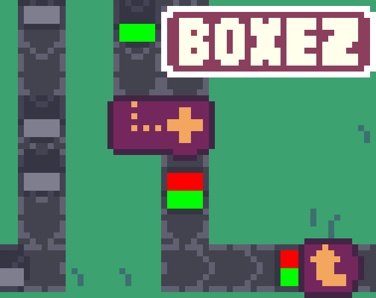

# Boxez

A game originally made for the [Lowrezjam 2024](https://itch.io/jam/lowrezjam-2024) game jam.

Play the latest version here: https://gheja.itch.io/boxez-latest

Play the jam version here: https://gheja.itch.io/boxez

The current version is just a short demo, I tried to fit a few optional themes like **Peaceful** and **All Systems Have Broken**.

## Controls

Mouse control is recommended with some keyboard shortcuts.

Keyboard shortcuts

  - [1] Conveyor belt
  - [2] Rotator (CW)
  - [3] Vertical splitter
  - [4] Horizontal splitter
  - [5] Merger
  - [0] Bulldozer
  - [Q] Normal cursor
  - [R] Rotate building (before placing)
  - [Arrow keys], [W][A][S][D] Scroll the screen

## Credits

  - Code, graphics - Gabor Heja
  - Music - Kim Lightyear ([OpenGameArt](https://opengameart.org/users/kly), [SoundCloud](https://soundcloud.com/kim-lightyear))
  - Sounds - Kenney ([kenney.nl](https://kenney.nl/))

## Changes

  - Bugfix: destroying a Merger while it has one box inside it will also destroy the box so it won't stuck on the map
  - The game no longer needs a separate window (Godot 4.3, single threaded web export)
  - Disabled the edge scrolling - arrow keys and WASD still works
  - GUI now fades out when player is inactive
  - Minor changes on the map
  - Some visual changes on the map

## Tips and Notes

  - The Merger can merge any shapes, even if they overlap.
  - The Merger can mix paints in an additive way (red + green = yellow, yellow + blue = white).
  - The paint works for already painted boxes as well, the colors will mix additively.
  - The Merger building needs two inputs on its two slots, if one slot is occupied it will block further boxes/paints from entering until the other slot receives a box/paint.
  - All the buildings can accept a box/paint from any direction but will output to the front, it works like a belt (in fact, there is a belt under the building that goes towards the front). 

